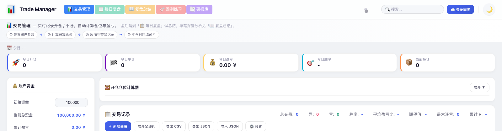
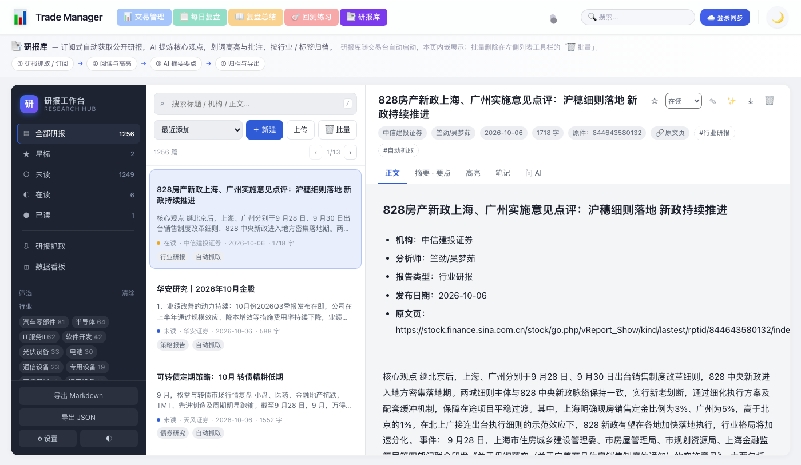

# TradeManager — 交易日志 / 仓位管理器

单页原生 JS 应用（中文 UI），用于记录交易日志、管理仓位、可视化收益曲线，并支持通过 Node.js/Express 后端进行多设备云端同步。

## ✨ 特性

- 📒 **交易日志** — 完整的开仓/平仓记录，支持多种买点类型
- 🧮 **开仓计算器** — 基于 R 倍数的仓位计算，自动推荐仓位和手数
- 📈 **收益曲线** — 累计收益、回撤、最大回撤等关键指标可视化
- 💰 **资金管理** — 入金/出金记录，自动计算当前资金
- 📊 **统计指标** — 胜率、盈亏比、期望值、最大连亏等
- 📝 **复盘总结** — 独立日记页面，记录交易心得
- ☁️ **云端同步** — 通过后端 API 多设备同步数据
- 🌓 **主题切换** — 支持明暗主题
- 📑 **研报库** — 集成独立的研报阅读整理服务，顶部导航一键进入（详见下文）
- 🌐 **中文 UI** — 全中文界面，硬编码字符串

## 📑 研报库（集成功能）

顶部导航栏的 **📑 研报库** 入口指向 `research.html`，**和「每日复盘」「回测练习」一样在当前标签页内切换**，
页内用 iframe 内嵌 `/research/`（由 `server/research-proxy.js` 反向代理到 `research-hub/` 那个独立 Python 服务）。

用 iframe 而不是直接把研报库的页面拼进来，是为了让两套样式与脚本完全隔离：
研报库自己的 `style.css` / `app.js` 里有 `.btn`、`.card`、`.modal` 这类通用类名，
和交易台的 `main.css` 会互相覆盖；iframe 一次规避了所有冲突，也省掉了改造那边布局的成本。





**能力**：订阅式自动抓取公开研报（东方财富 / 新浪财经双源）、按行业/主题批量回填、
AI 摘要与核心观点、划词高亮与批注、按行业标签归档、**批量删除**（按时间 / 按阅读状态）、Markdown/JSON 导出。

**批量删除**：列表工具栏的「🗑 批量」按钮。支持按报告日期或入库时间删除、按阅读状态删除，
可限定「仅抓取入库的」或「仅手动新建的」，**星标研报默认受保护**（需显式勾选才会一起删）。
弹窗里会实时显示"将删除 N 篇"及来源/状态明细，确认后二次确认才真正执行，删除会连同高亮与笔记。

**启动方式：没有额外步骤，跟着交易台一起起。**

`npm start`（或 `node server/server.js`）启动交易台时，会自动把研报库作为**子进程**拉起来：

- 已经在跑就复用，不重复启动；
- 进程意外挂掉会在 5 秒后自动重启（最多 5 次）；
- 交易台退出（Ctrl+C / `kill`）时子进程一并结束，不留孤儿进程；
- 首次启动若缺 Python 依赖，会自动 `pip install`，日志在 `server/research.log`；
- 万一没起来，`/research/` 会显示引导页并自动重试，页面上也有「🚀 启动研报库」按钮。

> 想关掉这个行为：`RESEARCH_AUTOSTART=0 npm start`。单独调试研报库可跑
> `bash scripts/start-research.sh`（前台运行，直接看日志）。
> 重启接口 `POST /api/research/start` **只接受本机请求**：非回环 IP（含反代场景下的
> `X-Forwarded-For` / `X-Real-IP`）一律 403，公网访客无法触发服务器上的进程启动。

**设计要点**：

- 代理只挂在 `/research` 前缀下，不碰任何既有路由（`/api/*` 与静态资源原样不变）；
- 上游不可用时返回 503：页面请求给引导页，`/research/api/*` 给 JSON，绝不抛异常拖垮主站；
- 研报库数据存在 `research-hub/data/`（已 gitignore），与交易台的 `server/data.db` 互不相干；
- 端口可用 `RESEARCH_PORT` 改，挂载前缀可用 `RESEARCH_PATH` 改。

### 部署到服务器

`scripts/deploy.sh` 重启交易台后，研报库会由交易台自动拉起，无需额外配置。前提与注意事项：

| 项 | 说明 |
| --- | --- |
| Python | 服务器需要 Python 3.9+。`scripts/start-research.sh` 会自动装依赖，并依次尝试：常规 pip → `--break-system-packages`（新版 Ubuntu 的 PEP 668 限制）→ 独立 `.venv`。全部失败时只影响 `/research/`，交易台照常运行，`server/research.log` 里能看到原因。 |
| 代码 | `git push` 会带上 `research-hub/` 全部代码（41 个文件）。 |
| **数据** | ⚠️ **不会同步**。`research-hub/data/` 在 `.gitignore` 里，所以服务器部署完是**空库，只有 3 篇内置示例研报**。好消息是部署也不会覆盖服务器上已有的数据。 |
| AI Key | 存在研报库自己的数据库里（`data/research.db` 的 settings 表），服务器上是空的，需要在服务器页面的「设置」里重新填一次——或者用下面的方式把本地库整体推上去。 |

**首次部署后是空库**：库里只有 3 篇内置示例研报。本地库只是开发测试用，**不与服务器同步**
（研报库的数据本来就该以服务器那份为准）。在服务器上这样把库填起来：

1. 进「研报库 → 设置」，填一次 AI 的 Base URL / API Key（Key 存在服务器自己的库里，不会跟随代码走）；
2. 进「研报库 → 研报抓取」：
   - 想一次性回填历史：「按行业 / 主题批量导入」选好主题与天数，开始即可；
   - 想持续更新：打开「自动获取研报」开关，两条内置订阅会按小时自动抓新研报；
3. 抓完的研报在左侧「全部研报」里，可按行业 / 机构 / 标签筛选。

> 本地想验证部署效果，可以只拷 git 会推送的文件（不含 `research-hub/data/`）另起一份跑，
> 用 `PORT=3100 RESEARCH_PORT=8865 node server/server.js` 避开端口冲突。

## 📁 项目结构

```
TradeManager/
├── public/                       # 前端静态资源
│   ├── index.html                # 主交易日志页面
│   ├── diary2.html               # 复盘总结页面（独立）
│   ├── css/
│   │   ├── main.css              # 主页面样式
│   │   └── diary2.css            # 复盘页面样式
│   ├── js/                       # 前端脚本（按加载顺序）
│   │   ├── utils.js              # 工具函数（日期、格式化、转义）
│   │   ├── database.js           # IndexedDB 数据管理
│   │   ├── sync.js               # 与后端 API 同步
│   │   ├── storage.js            # localStorage 备份/计算函数
│   │   ├── calculator.js         # 开仓仓位计算器
│   │   ├── table.js              # 表格渲染
│   │   ├── charts.js             # 图表绘制（收益曲线等）
│   │   ├── main.js               # 主入口
│   │   └── diary2.js             # 复盘页面逻辑
│   └── debug/                    # 调试页面（非生产）
│       ├── debug_data.html
│       ├── debug_delete.html
│       ├── debug_storage.html
│       ├── debug_table.html
│       └── test_delete.html
├── server/                       # 后端
│   ├── server.js                 # Express + SQLite 服务器
│   ├── research-proxy.js         # 研报库反向代理（/research/* → 127.0.0.1:8765）
│   ├── package.json              # 后端依赖
│   ├── package-lock.json
│   ├── start.bat                 # Windows 启动脚本
│   ├── data.db                   # SQLite 数据库（运行时生成，gitignore）
│   └── node_modules/             # 后端依赖
├── research-hub/                 # 研报库（独立 Python 服务，被 /research/ 代理）
│   ├── server.py                 # FastAPI 入口
│   ├── researchhub/              # 数据层 / 抓取 / AI / 回填
│   ├── web/                      # 前端（原生 JS，无构建）
│   └── data/                     # 研报库数据（运行时生成，gitignore）
├── scripts/                      # 启动与部署脚本
├── tests/                        # 测试用例
│   ├── helpers/
│   │   └── browser-mock.js       # 浏览器环境模拟器
│   ├── frontend/                 # 前端单元测试（Node.js test runner）
│   │   ├── utils.test.js
│   │   ├── calculator.test.js
│   │   ├── storage.test.js
│   │   └── sync.test.js
│   ├── backend/                  # 后端 API 集成测试
│   │   ├── test_utils.js
│   │   └── test_api.js
│   └── e2e/                      # Playwright 端到端 UI 测试
│       ├── pages/                # 页面对象模型 (POM)
│       ├── fixtures/             # 测试夹具
│       ├── specs/                # 测试规格
│       ├── utils/                # 测试工具
│       └── README.md             # E2E 测试详细文档
├── playwright.config.js          # Playwright 配置（多浏览器）
├── screenshots/                  # 主动截图（gitignore）
├── test-results/                 # 测试产物（gitignore）
├── playwright-report/            # HTML 报告（gitignore）
├── .gitignore
├── AGENTS.md                     # Agent 协作指南
├── package.json                  # 根项目配置（测试脚本）
└── README.md
```

## 🚀 快速开始

### 启动后端（需要云端同步时）

```bash
cd server
npm install        # 首次运行
node server.js     # 启动在端口 3000
```

或双击 `server/start.bat`（Windows）。

### 仅前端（无需同步/API）

直接在浏览器中打开 `public/index.html` 即可。IndexedDB + localStorage 无需服务器即可工作。

## 🧪 测试

使用 Node.js 内置测试运行器（无需安装额外依赖）。

```bash
# 运行所有测试（需要先启动后端服务器）
npm test

# 仅前端测试（无需服务器）
npm run test:frontend

# 仅后端 API 测试
npm run test:backend

# 监听模式（仅前端）
npm run test:watch

# 启动服务器
npm start
```

### 测试统计

- **前端单元测试**：134 个测试，覆盖 utils / calculator / storage / sync 模块
- **后端 API 测试**：39 个测试，覆盖认证、CRUD、管理员权限、复盘总结等
- **E2E UI 测试** (Playwright)：80+ 个测试场景，覆盖 10 个功能模块
- **合计**：250+ 个测试

### 端到端测试 (Playwright)

使用 Playwright 进行真实浏览器自动化测试，完整文档见 [`tests/e2e/README.md`](tests/e2e/README.md)。

```bash
# 安装 Playwright 浏览器（首次运行）
npx playwright install

# 运行 E2E 测试
npm run test:e2e

# UI 模式（可视化调试）
npm run test:e2e:ui

# 调试模式（逐步骤）
npm run test:e2e:debug

# 指定浏览器
npm run test:e2e:edge

# 查看 HTML 报告
npm run test:e2e:report
```

**E2E 测试覆盖的功能模块**：

- 页面加载和导航
- 用户认证（注册、登录、修改密码、退出）
- 开仓结算计算器
- 交易记录 CRUD
- 资金管理（入金/出金）
- 统计面板
- 主题切换
- 数据同步
- 复盘总结
- 边界条件和异常场景

**支持多浏览器（仅使用 Edge）**：

- edge — Edge 桌面默认

> 用户机器只安装了 Microsoft Edge，因此测试仅使用 Edge 浏览器。如果需要扩展到其他浏览器，可在 `playwright.config.js` 中启用 `firefox` / `webkit` / `chromium` 等项目。

**测试产物**：

- `playwright-report/` — HTML 报告
- `test-results/` — 失败时的截图/视频/追踪
- `screenshots/` — 主动调用的截图

### 后端 API 测试环境变量

```bash
# 指定测试服务器地址（默认 http://localhost:3000）
set TEST_BASE_URL=http://localhost:3050
node --test tests/backend/test_api.js
```

## 🏗️ 架构

### 数据流

| 层级    | 存储           | 文件                      |
| ----- | ------------ | ----------------------- |
| 主存储   | IndexedDB    | `public/js/database.js` |
| 备份/后备 | localStorage | `public/js/storage.js`  |
| 云端同步  | SQLite       | `server/data.db`        |

### 字段名映射

前端使用 camelCase，后端使用 snake\_case。映射关系见 `public/js/sync.js` 的 `tradeToServerFormat` / `tradeFromServerFormat`：

| 前端           | 后端              |
| ------------ | --------------- |
| `date`       | `open_date`     |
| `exitDate`   | `close_date`    |
| `buyType`    | `type`          |
| `dir`        | `direction`     |
| `entry`      | `entry_price`   |
| `stop`       | `stop_loss`     |
| `target`     | `take_profit`   |
| `posSize`    | `position_size` |
| `riskAmount` | `r_amount`      |
| `exit`       | `close_price`   |
| `pnl`        | `pnl_amount`    |
| `note`       | `notes`         |

### 前端加载顺序

`public/index.html` 通过 `<script>` 标签按严格顺序加载：

```
utils.js → database.js → sync.js → storage.js → calculator.js → table.js → charts.js → main.js
```

**加载顺序至关重要。** 后面的文件依赖前面文件的全局变量。`<script>` 标签使用 `?v=N` 防缓存，修改任何 JS 文件时需递增版本号。

## 📐 API 端点

| 方法     | 路径                             | 说明        |
| ------ | ------------------------------ | --------- |
| POST   | `/api/register`                | 注册用户      |
| POST   | `/api/login`                   | 登录        |
| POST   | `/api/change-password`         | 修改密码      |
| GET    | `/api/sync/:userId`            | 拉取用户全部数据  |
| POST   | `/api/trades/:userId`          | 添加/更新单笔交易 |
| DELETE | `/api/trades/:userId/:tradeId` | 删除单笔交易    |
| POST   | `/api/deposits/:userId`        | 添加入金      |
| POST   | `/api/withdrawals/:userId`     | 添加出金      |
| POST   | `/api/settings/:userId`        | 保存账户设置    |
| POST   | `/api/diary/:userId`           | 保存复盘日记    |
| GET    | `/api/diary/:userId`           | 获取复盘日记    |
| DELETE | `/api/clear/:userId`           | 清空用户数据    |
| GET    | `/api/admin/users`             | 管理员：用户列表  |
| GET    | `/api/admin/stats`             | 管理员：系统统计  |
| GET    | `/api/admin/user/:userId`      | 管理员：用户详情  |

## 🛠️ 开发

### 代码规范

- 前端代码大部分使用 `var`（旧代码风格），`sync.js` 中新增的异步代码使用 `let`/`const`
- 暴露给 HTML `onclick` 的函数必须是全局的
- 弹窗通过 `style.display = 'flex'` / `'none'` 切换
- 日期格式：`YYYY-MM-DD` 字符串
- 货币：人民币（￥），通过 `utils.js` 中的 `CNY()` 格式化

### 全局命名空间

所有前端 JS 文件共享全局作用域。变量/函数名没有命名空间。添加新的全局变量前先检查已有名称（`trades`、`deposits`、`withdrawals` 等是已存在的全局）。

### 修改脚本

修改任何 JS 文件后，需要在 `index.html` / `diary2.html` 中递增对应 `<script>` 标签的 `?v=N` 版本号以避免浏览器缓存。

## 📜 许可证

仅供个人使用。
