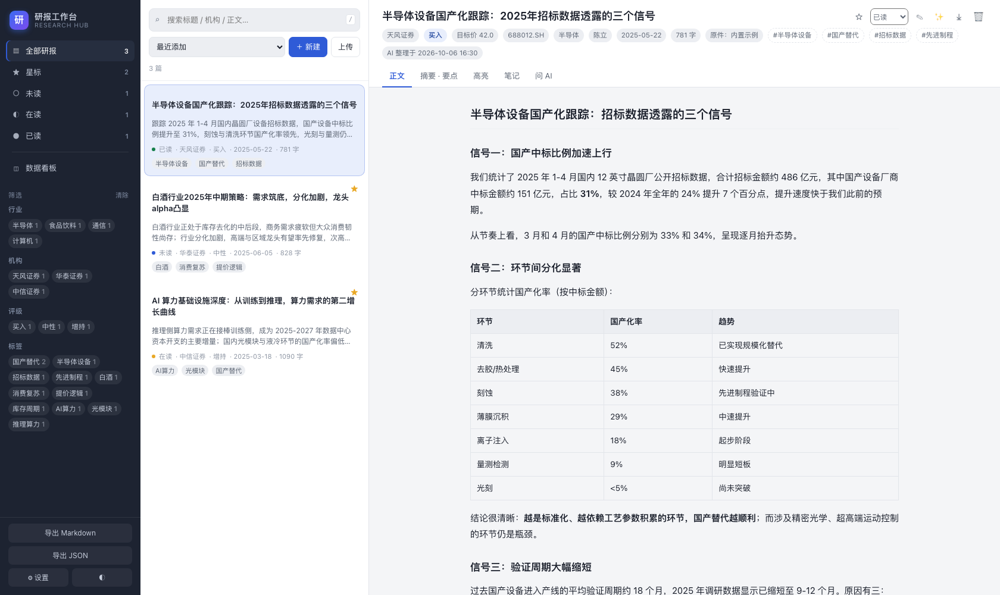
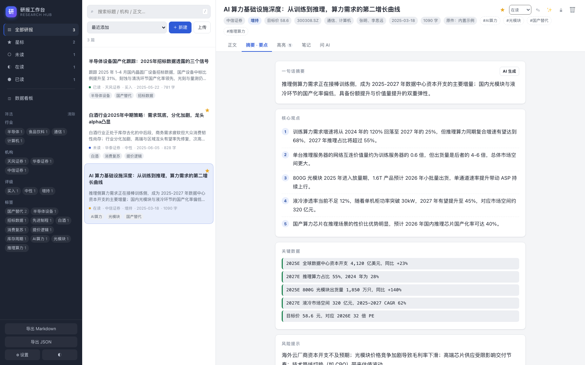
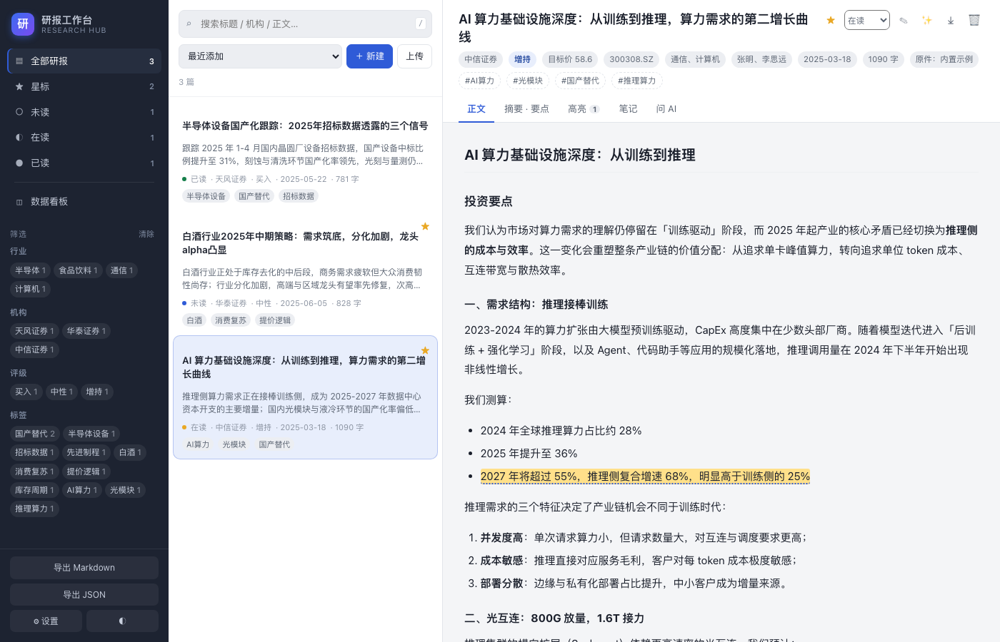
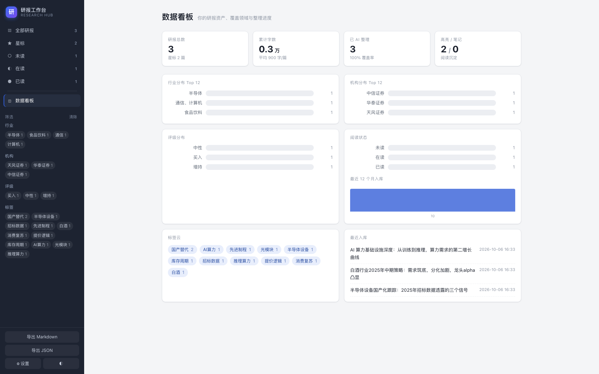
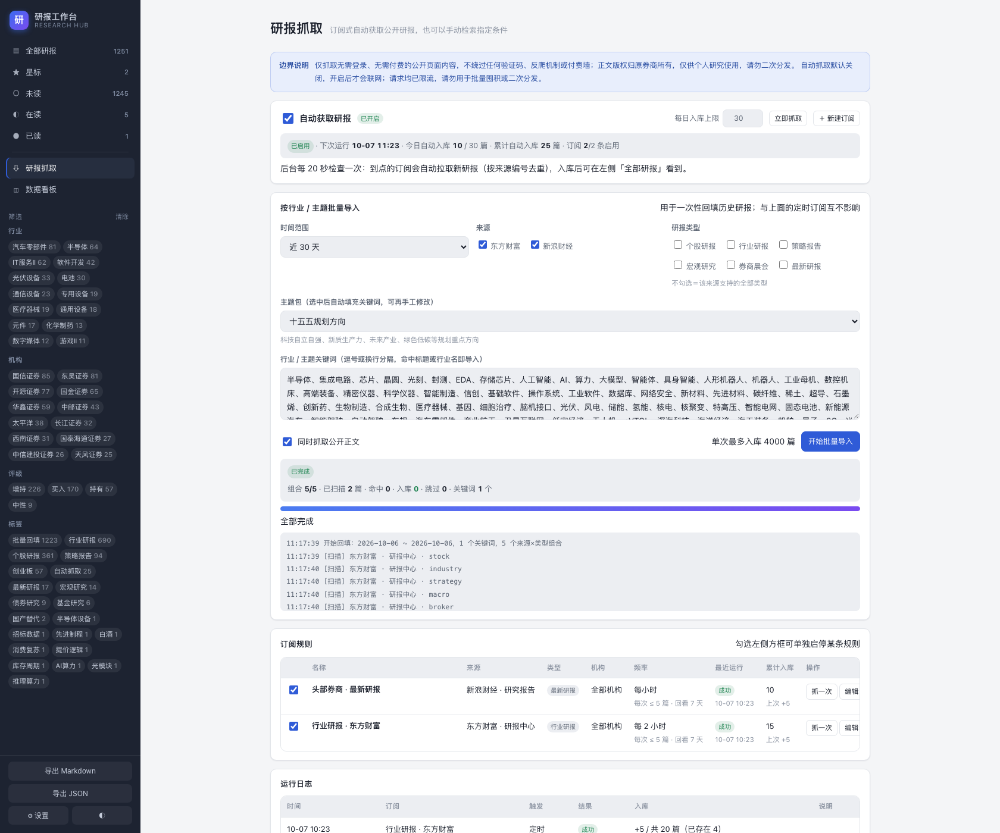
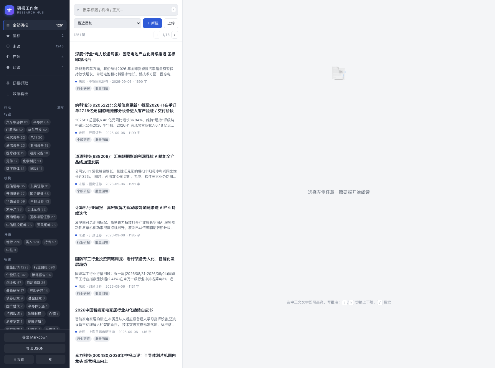
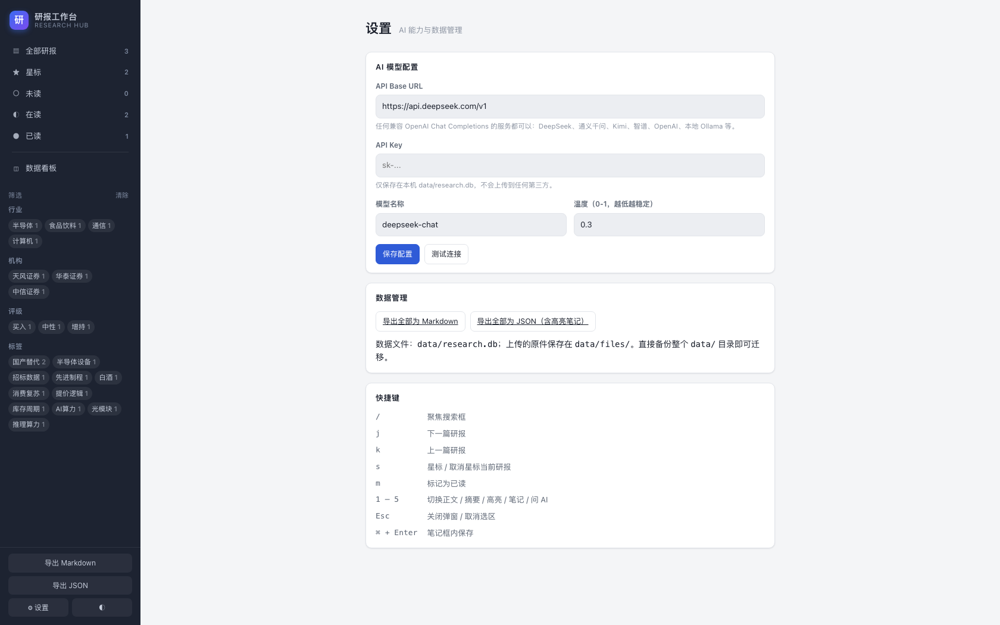

# 研报阅读整理工作台 · Research Hub

一个跑在本机的券商研报阅读与整理工具：**订阅式自动获取 / 按行业批量回填研报 → 边读边划重点 → AI 帮你提炼要点 → 按行业 / 机构 / 标签归档 → 一键导出成 Markdown**。

数据全部存在本地 SQLite（`data/research.db`），不联网、不上传（只有调用 AI 或手动抓取研报时才会访问外部）。

## 界面预览

| 三栏阅读工作台 | AI 摘要与要点 |
| --- | --- |
|  |  |

| 划词高亮与批注 | 数据看板 |
| --- | --- |
|  |  |

| 订阅式自动获取 | 自动入库的研报已在库中 |
| --- | --- |
|  |  |



---

## 快速开始

```bash
cd research-hub
./run.sh                 # 首次会自动检查依赖并启动
```

打开 <http://127.0.0.1:8765> 即可。首次启动会自动写入 3 篇示例研报与 2 条示例订阅，可以直接体验，随时删除。

**想直接开始自动获取**：左侧栏「研报抓取」→ 打开右上角「自动获取研报」开关。开关一开就会立刻抓一轮，之后按订阅频率在后台自动运行。

手动启动：

```bash
python3 server.py                 # 默认 127.0.0.1:8765，自动打开浏览器
python3 server.py --port 9000     # 换端口
python3 server.py --no-browser    # 不自动开浏览器
python3 server.py --reseed        # 清空研报并重新写入示例数据
```

---

## 核心功能

### 1. 导入研报
- **上传 PDF**：拖拽文件到窗口任意位置，或点「上传」。自动抽取正文，并尝试识别标题、机构、分析师、行业、评级、目标价、股票代码、报告日期。
- **粘贴文本 / Markdown**：点「＋ 新建」，正文栏粘贴即可，同样走自动识别。
- 支持 `.pdf` / `.txt` / `.md`，单文件上限 60MB。扫描版 PDF（图片型）抽不出文字，会给出提示。

### 2. 阅读与标注
- 正文自动按 Markdown 渲染（支持标题、列表、表格、引用、代码块）。
- **划词高亮**：选中任意文字 → 浮动工具条选择颜色（黄 / 绿 / 粉 / 蓝），高亮永久保存在本地并在正文中还原显示。
- **批注**：划词后点 ✎，或在高亮列表里补写批注；带批注的高亮下方会显示虚线标记。
- **笔记**：整篇级别的思考记录，可编辑、删除。
- **阅读状态**：未读 → 在读（打开即自动切换）→ 已读，左侧栏一键筛选。

### 3. AI 整理
在「设置」里填入任意 **OpenAI 兼容**接口的 `Base URL` + `API Key` + 模型名即可启用：

| 服务 | Base URL | 模型示例 |
| --- | --- | --- |
| DeepSeek | `https://api.deepseek.com/v1` | `deepseek-chat` |
| 阿里通义 | `https://dashscope.aliyuncs.com/compatible-mode/v1` | `qwen-plus` |
| 月之暗面 Kimi | `https://api.moonshot.cn/v1` | `moonshot-v1-32k` |
| 智谱 GLM | `https://open.bigmodel.cn/api/paas/v4` | `glm-4-plus` |
| OpenAI | `https://api.openai.com/v1` | `gpt-4o-mini` |
| 本地 Ollama | `http://127.0.0.1:11434/v1` | `qwen2.5:14b` |

配置后可用的能力：
- **✨ 一键整理**：生成一句话摘要、核心观点（3-6 条）、关键数据（带数字）、风险提示、主题标签，并回填评级与目标价。
- **问 AI**：针对单篇研报提问，只依据该篇正文回答，上下文里没有的会明确说「研报中未提及」。
- **测试连接**：设置页可直接验证 Key 与模型是否可用。

### 4. 归档与检索
- 全文搜索（标题 / 机构 / 分析师 / 行业 / 摘要 / 标签 / 正文）。
- 左侧按 **行业、机构、评级、标签** 多维筛选，可叠加；顶部显示当前筛选条件，可单独移除。
- 星标收藏、按最近添加 / 报告日期 / 篇幅 / 标题排序。

### 5. 数据看板
研报总数、累计字数、AI 整理覆盖率、高亮与笔记数量；行业分布、机构分布、评级分布、阅读状态、最近 12 个月入库热度、标签云、最近入库列表。

### 6. 自动获取公开研报（订阅式）

左侧栏「研报抓取」。核心是**订阅规则**：建好规则后，后台线程每 20 秒检查一次，到点就自动抓新研报入库，不用再手动点。

**打开开关就会立刻抓一轮**，之后按各订阅的频率自动运行。默认已内置两条示例订阅（可改可删）：

| 订阅 | 来源 | 频率 | 每次入库 |
| --- | --- | --- | --- |
| 头部券商 · 最新研报 | 新浪财经 | 每小时 | ≤ 5 篇 |
| 行业研报 · 东方财富 | 东方财富 | 每 2 小时 | ≤ 5 篇 |

每条订阅可配置：来源、研报类型、机构（可限定某家券商）、关键词、频率（15 分钟 ~ 每天）、每次最多入库、回看天数、是否抓正文、单独启停。

| 来源 | 覆盖 | 可用筛选 |
| --- | --- | --- |
| 东方财富 · 研报中心 | 结构化公开接口，元数据最全（评级 / 行业 / 分析师 / 页数）；机构表 61 家，含中小券商、外资券商与研究机构 | 个股 / 行业 / 策略 / 宏观 / 券商晨会，按机构、股票代码、时间、关键词 |
| 新浪财经 · 研究报告 | 覆盖头部券商（中信建投、华泰证券、中金公司、国泰海通、天风、东吴…），机构表 165 家 | 最新 / 行业 / 策略 / 宏观，按机构全称、时间、关键词 |

**安全阀**（都是为了防止半夜把来源站点刷爆、或把你的库塞满）：

- 总开关**默认关闭**，不开就不会联网；
- 每条订阅单次最多入库 N 篇（默认 5），日志会提示「还有 N 篇留到下次」；
- 全库**每日自动入库上限**（默认 30 篇，可在面板上改），触顶后当天只记一条「已达上限」；
- 全局同一时刻只跑一个抓取任务（并发请求返回 409），请求间隔 0.5–1.1 秒；
- 每条订阅的执行结果都写进「运行日志」，失败原因原样保留。

去重按来源的研报编号（`source_file`）做，反复运行只会把列表里**尚未入库**的下一篇拉进来，不会产生重复条目。入库内容包含机构、分析师、评级、行业、发布日期、**原文页链接**、抓取到的公开正文，以及自动生成的摘要，标签统一带 `自动抓取`，方便在左侧栏一键筛出来。

**手动检索**（页面底部的折叠区）保留着：临时找某个机构 / 关键词、不入订阅时用它。

**边界（重要）**：只抓取**无需登录、无需付费**的公开页面；不绕过、不破解任何验证码、反爬挑战或付费墙。东方财富公开接口下的头部券商研报多为付费内容，因此不在抓取范围内——需要头部券商研报时请用新浪来源。PDF 原件下载接口带有反爬挑战，工具不会去破解，正文取自公开正文页。

### 7. 按行业 / 主题批量导入

页面上的「按行业 / 主题批量导入」面板，用于一次性回填历史研报。选好**时间范围 + 来源 + 类型 + 行业/主题关键词**，点开始即可。

内置主题包（可直接用，也能在文本框里改成自己的关键词）：

| 主题包 | 关键词数 | 含义 |
| --- | --- | --- |
| 十五五规划方向 | 80 | 科技自立自强、新质生产力、未来产业、绿色低碳等规划重点方向 |
| 科技自立自强 | 18 | 卡脖子环节与国产替代 |
| 新能源与绿色低碳 | 15 | 能源转型、储能与电网 |
| 未来产业 | 13 | 商业航天、低空经济、深海科技、脑机接口等 |

匹配规则：**关键词命中标题或行业名**即导入（中文子串匹配，`AI`/`6G` 这类英文按词边界匹配，避免误伤）。

流水线分两段，目的是让你**尽快拿到完整目录**：

1. **扫描阶段**（快）：逐页翻来源列表，命中的先只写元数据（标题 / 机构 / 分析师 / 评级 / 行业 / 日期 / 原文链接）；
2. **补正文阶段**（慢）：再回头给这批新条目逐篇抓公开正文，同时生成摘要。

任务可随时**停止**，已入库的保留；**再跑一次会自动接着补差集**（按来源编号去重），不会重复。进度、命中数、入库数实时显示，带运行日志。

### 8. 导出
- 单篇：阅读区右上角 ⤓ 导出为 Markdown（含摘要、观点、数据、风险、高亮摘录、笔记、正文、原文链接）。
- 全库：左侧栏底部「导出 Markdown / 导出 JSON」，JSON 含全部高亮与笔记，便于备份或迁移。

---

## 快捷键

| 按键 | 作用 |
| --- | --- |
| `/` | 聚焦搜索框 |
| `j` / `k` | 下一篇 / 上一篇 |
| `s` | 星标当前研报 |
| `m` | 标记为已读 |
| `1`–`5` | 切换 正文 / 摘要 / 高亮 / 笔记 / 问 AI |
| `Esc` | 关闭弹窗、取消选区 |
| `⌘/Ctrl + Enter` | 笔记框、提问框内直接提交 |

---

## 目录结构

```
research-hub/
├── server.py              # 启动入口（FastAPI + uvicorn）
├── run.sh                 # 一键启动脚本
├── researchhub/
│   ├── db.py              # SQLite 数据层（建表 / 设置 / 轻量迁移）
│   ├── extract.py         # PDF 抽取 + 元数据启发式识别
│   ├── ai.py              # 大模型调用（摘要 / 问答）
│   ├── feeds.py           # 公开研报抓取（东方财富 / 新浪财经 双源适配）
│   ├── autofetch.py       # 订阅式自动抓取调度（后台线程 / 限流 / 每日上限）
│   ├── backfill.py        # 按行业/主题批量回填（扫描 + 补正文两阶段，可中断续跑）
│   ├── api.py             # REST 接口 + 导出
│   └── seed.py            # 内置示例研报
├── web/
│   ├── index.html
│   ├── style.css
│   └── app.js             # 前端全部逻辑（零构建、零依赖）
└── data/                  # 运行时生成
    ├── research.db        # 你的研报、高亮、笔记、设置
    └── files/             # 上传的原始文件
```

**备份 / 迁移**：直接拷走整个 `data/` 目录即可。

---

## 依赖

- Python 3.9+
- `fastapi`、`uvicorn`、`httpx`、`pypdf`、`beautifulsoup4`（抓取正文用）

```bash
pip3 install fastapi uvicorn httpx pypdf beautifulsoup4
```

前端为原生 HTML/CSS/JS，无需 Node 与构建步骤。

---

## 常见问题

**PDF 导入后没有正文？**
多半是扫描件（图片型 PDF）。本工具用的是文本层抽取，不含 OCR。可以先用系统预览/其他工具 OCR，再把文字粘贴进「＋ 新建」。

**AI 报错怎么办？**
1. 到「设置」确认 Base URL 是否带 `/v1` 这类版本路径（各服务商不同，见上表）；
2. 点「测试连接」看返回的错误信息——常见的是 Key 无效、余额不足、模型名写错；
3. 若网关不支持 `response_format`，程序会自动降级重试，无需干预。

**会自动抓取，会不会在我不知道的时候一直联网？**
不会。总开关默认**关闭**，不打开就完全不联网。打开后也只有你启用（勾选）的那些订阅会被执行，并受「每条订阅每次最多 N 篇 + 每日上限 + 全局单任务」三重限制。想停下把总开关关掉即可（正在跑的那一轮会跑完）。

**自动抓取入库的都是什么？**
只有来源站点**公开可见**的研报：标题、机构、分析师、评级、行业、发布日期、原文页链接，以及公开正文页上能读到的正文。扫描件、需登录内容、付费内容都不在其中。

**抓取时提示「来源返回了空列表」？**
新浪财经对突发请求频率敏感，短时间内请求过多会返回 HTTP 200 的空列表。工具已把间隔放到 1.1 秒/次并自动退避重试一次，通常等几秒再搜即可。东方财富来源一般不会出现这种情况。

**批量导入到一半不想跑了怎么办？**
点「停止」。已入库的条目会保留（只是正文可能还没补），下次再点「开始批量导入」会自动跳过已有的，接着补剩下的——所以不必一次跑完。任务也支持传显式起止日期（`begin` / `end`），可以把长区间拆成几段跑，中断只丢一段。

**只想补正文，不想重新扫一遍？**
把区间设成一天、勾上「同时抓取公开正文」再跑：扫描很快结束，补正文阶段会自动捞库里所有**还缺正文**的抓取条目（跨任务续跑），一次补齐。

**抓不到某些头部券商的研报？**
东方财富公开接口只对外开放一部分机构（机构下拉 61 家），中信、华泰等头部券商的研报在该接口下多为付费内容，工具不会去绕过。请切换到「新浪财经 · 研究报告」来源，它的机构表有 165 家，可用「按机构全称检索」。

**端口被占用？**
`python3 server.py --port 9000`。

**想推到公网？**
当前实现是纯本地服务，没有账号体系与鉴权，**不要**直接暴露到公网。需要多人使用时，至少要先加登录鉴权与 HTTPS 反向代理。
